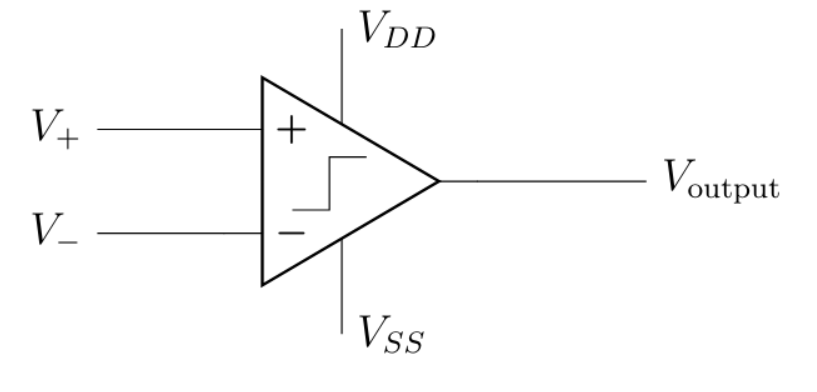
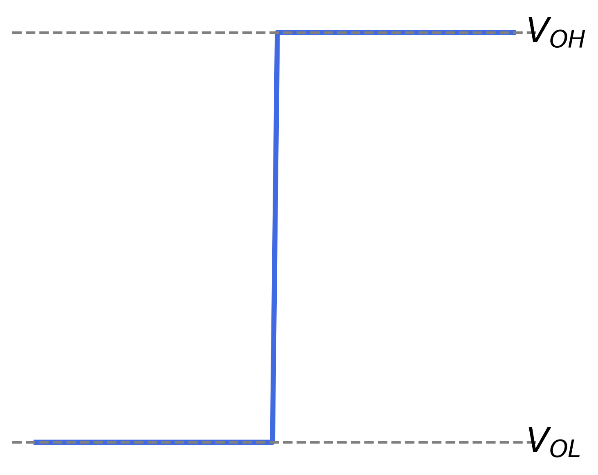
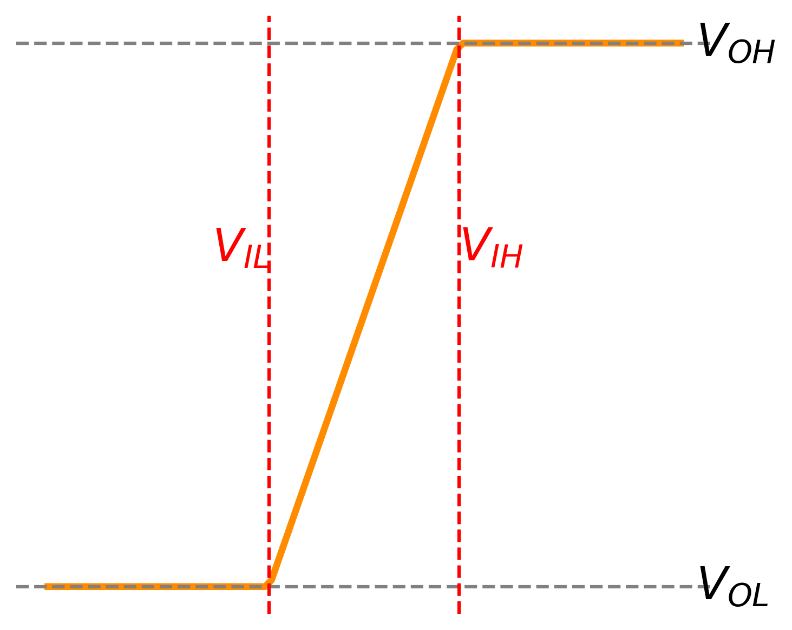

# Design of a Double-Threshold Discriminator in CMOS Technology for the FIT Detector in the ALICE Experiment at CERN

## Abstract

This work presents the design and analysis of a double-threshold discriminator implemented in 180 nm CMOS technology, dedicated to the Fast Interaction Trigger (FIT) detector in the ALICE experiment at CERN. The proposed solution enables precise time detection of fast analog signals with a wide amplitude range while minimizing time walk and jitter. Both discrete and ASIC implementations were analyzed and validated through simulations.

## Introduction

Modern high-energy physics experiments, such as ALICE at CERN, require extremely fast and precise signal processing systems. The FIT detector is responsible for triggering and timing measurements, which demand accurate detection of signals with nanosecond rise times and amplitudes ranging from a few millivolts to several volts .

Traditional single-threshold discriminators suffer from time walk effects, making them less suitable for precise timing applications. Therefore, a double-threshold discriminator architecture was chosen as a compromise between simplicity and timing accuracy.

## Methodology

The project consisted of two main stages:

1. Design and simulation of a discrete version of the discriminator in LTspice,
2. Full ASIC implementation in CMOS 180 nm technology using Cadence Virtuoso.

The system is based on two comparators with different thresholds (low and high), combined with digital logic to determine the correct timing of the input pulse.

## Comparator Design

The comparator is a fundamental building block of the proposed discriminator, responsible for converting analog input signals into digital logic levels. Its performance directly impacts the timing accuracy, jitter, and sensitivity of the entire system.

### Operating Principle

The comparator operates by comparing two input voltages, \( V_{+} \) and \( V_{-} \), and generating a digital output depending on their relation. In an ideal case, the output switches instantaneously when \( V_{+} = V_{-} \), producing a perfect step transition between low (\( V_{OL} \)) and high (\( V_{OH} \)) levels :contentReference[oaicite:0]{index=0}.

### Ideal vs Real Behavior

| Ideal Comparator | Real Comparator |
|-----------------|----------------|
|  |  |

In practice, the transition is not instantaneous. Real comparators exhibit a finite switching region defined by two thresholds: \( V_{IL} \) and \( V_{IH} \). The difference between these values introduces hysteresis, which improves noise immunity and prevents multiple switching events in the presence of small signal fluctuations.

### Design Considerations

In high-energy physics applications such as the ALICE FIT detector, the comparator must operate under demanding conditions:
- detection of signals as low as a few millivolts,
- nanosecond-scale rise times,
- high noise environment.

To meet these requirements, a preamplifier-based comparator architecture was selected. This approach provides:
- reduced input-referred offset,
- improved sensitivity,
- better immunity to noise and process variations.

The comparator serves as the core decision element in the double-threshold discriminator, enabling precise timing extraction from fast detector signals.

