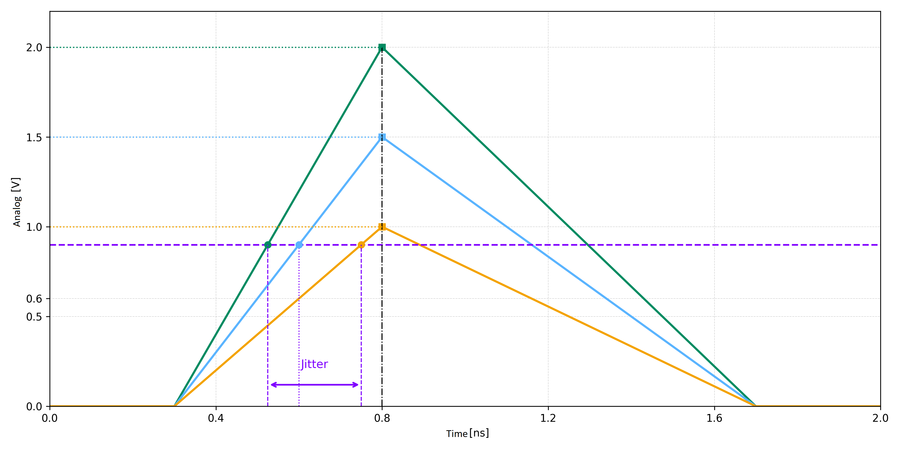
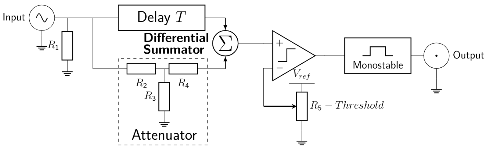
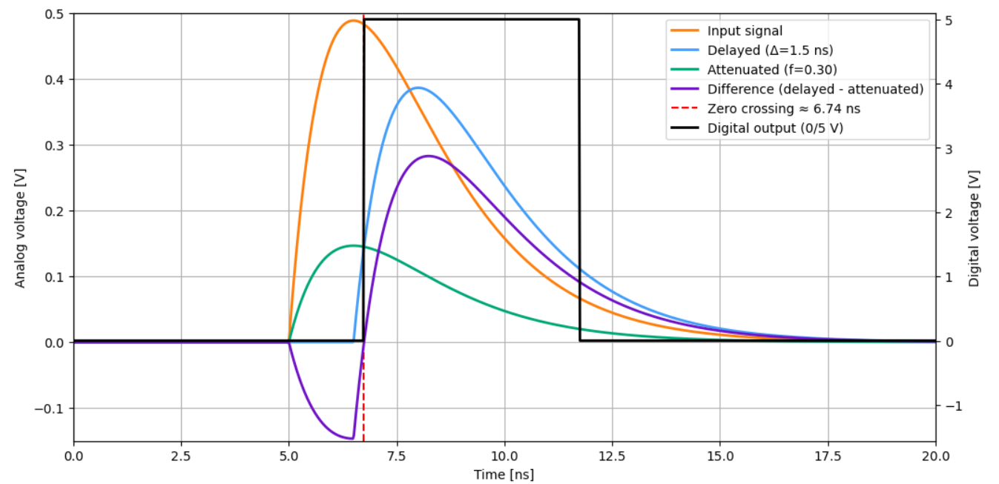
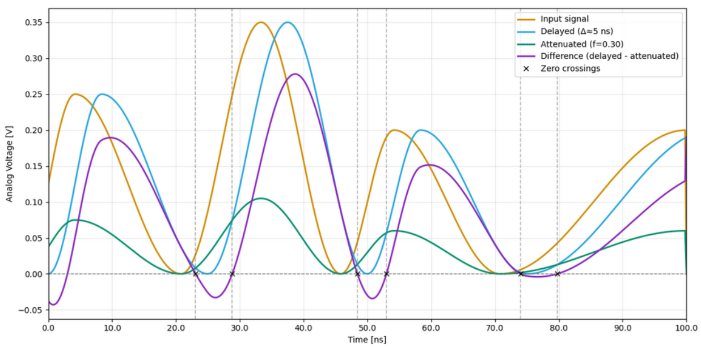
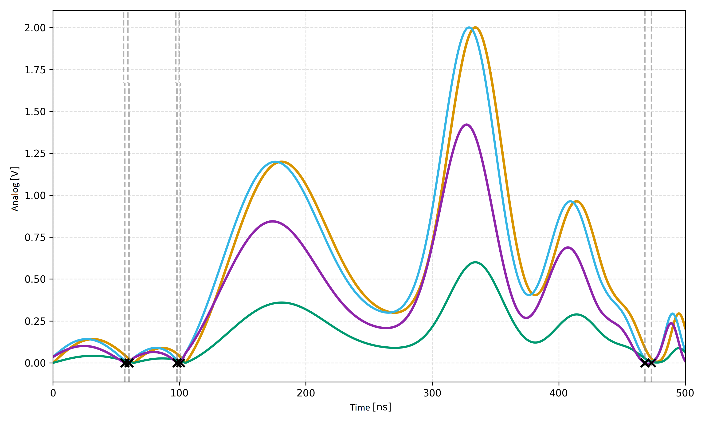
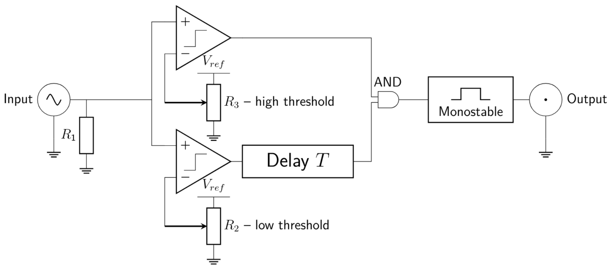
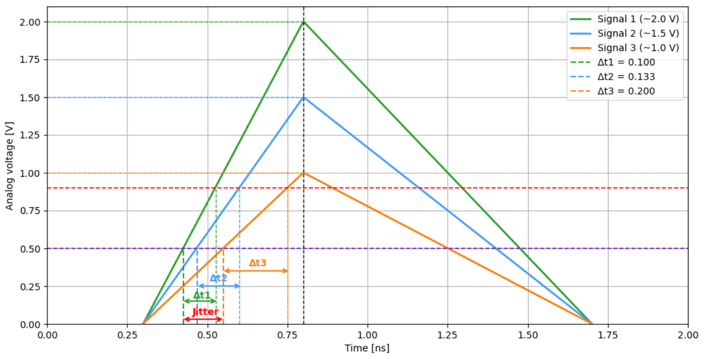
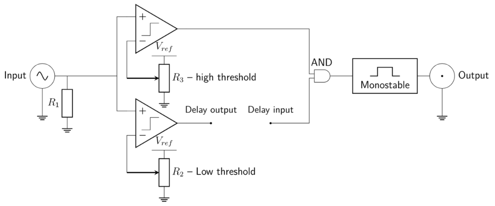
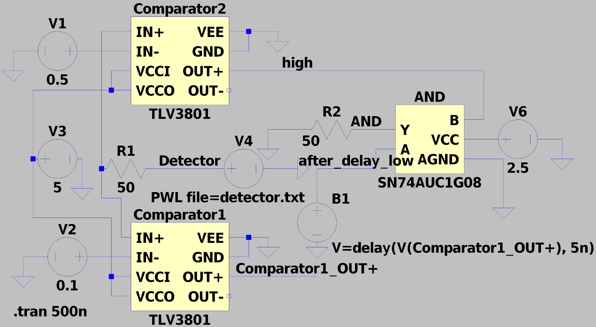
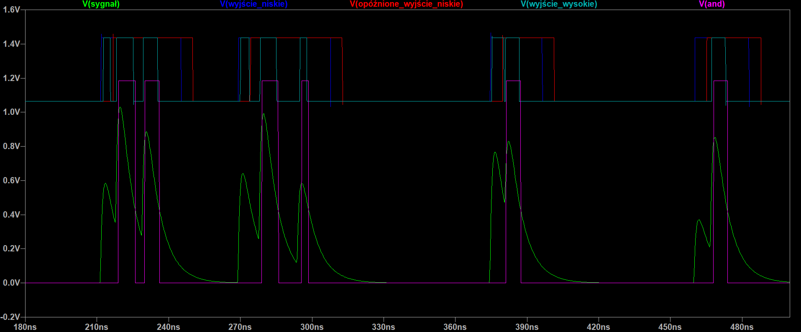

# Design of a Double-Threshold Discriminator in CMOS Technology for the FIT Detector in the ALICE Experiment at CERN

This work presents the design and analysis of a double-threshold discriminator implemented in 180 nm CMOS technology, dedicated to the Fast Interaction Trigger (FIT) detector in the ALICE experiment at CERN. The proposed solution enables precise time detection of fast analog signals with a wide amplitude range while minimizing time walk and jitter. Both discrete and ASIC implementations were analyzed and validated through simulations.

---

## Introduction

Modern high-energy physics experiments, such as ALICE at CERN, require extremely fast and precise signal processing systems. The FIT detector is responsible for triggering and timing measurements, which demand accurate detection of signals with nanosecond rise times and amplitudes ranging from a few millivolts to several volts .

Traditional single-threshold discriminators suffer from time walk effects, making them less suitable for precise timing applications. Therefore, a double-threshold discriminator architecture was chosen as a compromise between simplicity and timing accuracy.

---

## System Requirements

The designed double-threshold discriminator in CMOS technology must operate under demanding conditions imposed by the Fast Interaction Trigger (FIT) detector in the ALICE experiment at CERN.

The system is required to process two distinct classes of input signals originating from different types of photomultiplier tubes (PMTs), each characterized by significantly different electrical properties.

---

### Signal Classes

Two main categories of input signals were identified:

---

#### FT0 (MCP-PMT signals)
- Amplitude range: 3 mV – 2000 mV 
- Rise time: ~1.6 ns 
- Fall time: ~4 ns 
- Pulse charge: 31 pVs / 50 Ω per 1 mip 

---

#### FV0/FDD (fine mesh PMT signals)
- Amplitude range: 3 mV – 5000 mV 
- Rise time: ~6.5 ns 
- Fall time: ~10 ns 
- Pulse charge: 54 pVs / 50 Ω per 1 mip 

These parameters indicate that the discriminator must handle a wide dynamic range of input amplitudes while maintaining high timing precision for very fast signals.

---

## Methodology
The project consisted of two main stages:

1. Design and simulation of a discrete version of the discriminator in LTspice,
2. Full ASIC implementation in CMOS 180 nm technology using Cadence Virtuoso.

The system is based on two comparators with different thresholds (low and high), combined with digital logic to determine the correct timing of the input pulse.

---

## Comparator Design

The comparator is a fundamental building block of the proposed discriminator, responsible for converting analog input signals into digital logic levels. Its performance directly impacts the timing accuracy, jitter, and sensitivity of the entire system.

---

### Operating Principle


The comparator operates by comparing two input voltages, \( V_{+} \) and \( V_{-} \), and generating a digital output depending on their relation. In an ideal case, the output switches instantaneously when \( V_{+} = V_{-} \), producing a perfect step transition between low (\( V_{OL} \)) and high (\( V_{OH} \)) levels.

---

### Ideal vs Real Behavior

| Ideal Comparator | Real Comparator |
|-----------------|----------------|
|  |  |

In practice, the transition is not instantaneous. Real comparators exhibit a finite switching region defined by two thresholds: \( V_{IL} \) and \( V_{IH} \). The difference between these values introduces hysteresis, which improves noise immunity and prevents multiple switching events in the presence of small signal fluctuations.

---

### Design Considerations

In high-energy physics applications such as the ALICE FIT detector, the comparator must operate under demanding conditions:
- detection of signals as low as a few millivolts,
- nanosecond-scale rise times,
- high noise environment.

To meet these requirements, a preamplifier-based comparator architecture was selected. This approach provides:
- reduced input-referred offset,
- improved sensitivity,
- better immunity to noise and process variations.

The comparator serves as the core decision element in the double-threshold discriminator, enabling precise timing extraction from fast detector signals.

---

## Comparison of Discriminator Architectures

A discriminator is an electronic circuit used to detect signals exceeding a predefined voltage threshold and convert analog signals into digital form. Unlike a comparator, which only compares two voltages, a discriminator performs signal selection, distinguishing meaningful events from noise. This functionality is essential in particle detection systems, where fast and reliable signal processing is required.

In practice, three main discriminator architectures are commonly used:
- Leading Edge Discriminator (LED),
- Constant Fraction Discriminator (CFD),
- Dual-Threshold Discriminator (DTD).

---

## Leading Edge Discriminator (LED)

The **Leading Edge Discriminator (LED)** is one of the simplest threshold detection architectures used to convert analog signals into digital pulses. The circuit switches its output to a high state when the input signal exceeds a predefined voltage threshold.

The simplest implementation consists of a single comparator, where one input is connected to the signal and the second to a reference voltage \( V_{ref} \), which defines the detection threshold. The reference voltage can be either positive or negative, depending on the type of detected signals. When the input signal exceeds this threshold, the comparator generates a digital pulse at the output.

To prevent multiple triggering caused by noise or oscillations around the threshold, a **monostable circuit** is often added. This block generates an output pulse with a defined width, ensuring stable operation and preventing repeated triggering during a single rising edge.

In practice, such a simplified system may still be sensitive to noise and low-amplitude fluctuations. Therefore, additional stabilization techniques such as **hysteresis** are often used. This is typically implemented by introducing positive feedback (e.g., using an additional resistor), which improves noise immunity and reduces false switching near the threshold.

---

### LED schematic


*Figure: Simplified Leading Edge Discriminator with comparator and monostable block.*

The LED can operate with both positive and negative input pulses, depending on the selected threshold \( V_{ref} \). The monostable stage is optional and is used when there is a need to control output pulse width and suppress multiple triggering.

---

### Time walk (jitter effect)



*Figure: Threshold crossing for signals with different amplitudes.*

The waveform presents three input signals with different amplitudes:

- 🟢 **Green — Signal 1 (~2.0 V)** 
- 🔵 **Blue — Signal 2 (~1.5 V)** 
- 🟠 **Orange — Signal 3 (~1.0 V)** 

The **purple dashed line** represents the detection threshold (~0.9 V).

Although all signals start at the same time, they cross the threshold at different moments:
- Signal 1 → 0.525 ns 
- Signal 2 → 0.600 ns 
- Signal 3 → 0.750 ns 

The difference between detection times is called **time walk (jitter)** and in this case equals:

\[
\Delta t = 0.225 \text{ ns}
\]

It is illustrated by the **purple double arrow** on the plot.

---

## Constant Fraction Discriminator (CFD)

The Constant Fraction Discriminator (CFD) is designed to eliminate the **time walk effect**, making the detection time independent of signal amplitude.

---

### Principle of operation
The input signal is split into two paths:
- one is **attenuated** (typically 20–50% of amplitude),
- the other is **delayed** by a fixed time \(T\).

Both signals are then subtracted. The output is triggered at the **zero-crossing point** of the resulting signal, which corresponds to a constant fraction of the input pulse.

---

### Main characteristic
- detection occurs at the same relative point of the signal rise → **high timing precision**




*Figure: CFD architecture with delay line, attenuator, differential summation, and comparator.*




*Figure: CFD operation in time domain.*

Legend:
- 🟠 **Input signal** — original pulse (~0.34 V peak) 
- 🔵 **Delayed signal** — shifted by Δ ≈ **1.5 ns** 
- 🟢 **Attenuated signal** — scaled version (f ≈ **0.30**) 
- 🟣 **Difference signal** (delayed − attenuated)
- 🔴 **Zero-crossing** — trigger point (**~6.74 ns**) 
- ⚫ **Digital output (0/5 V)** — generated pulse 

The zero-crossing point is nearly independent of amplitude → minimal jitter.



*Figure: Multiple events (0–100 ns range).*

- ✖ **Black crosses** — detection points (zero-crossings) 
- signals remain time-aligned despite amplitude variations 



*Figure: Long time window (0–495 ns).*


| Time [ns] | Input signal amplitude [V] |
|----------|-----------------------------|
| 56.852   | 0.0139                      |
| 60.171   | 0.0074                      |
| 98.115   | 0.0163                      |
| 108.851  | 0.0126                      |
| 468.057  | 0.0274                      |
| 473.379  | 0.0074                      |

The results confirm that detection occurs at very low voltage levels, 
well below the signal peak. This demonstrates that CFD timing depends on 
the signal shape rather than its amplitude, effectively eliminating time walk.

---

## Dual-Threshold Discriminator (DTD)

The Dual-Threshold Discriminator (DTD) improves timing accuracy by using **two voltage thresholds** instead of one.

### Principle of operation
The input signal is monitored using:
- a **low threshold (Vlow)** – detects the early presence of the signal,
- a **high threshold (Vhigh)** – confirms that the signal amplitude is valid.

When the signal crosses the low threshold, time \(t_1\) is registered and delayed. 
If the signal also crosses the high threshold within a defined time window, the output is generated.

---



*Figure: Dual-threshold discriminator with two comparators, delay block, AND logic, and monostable.*

---



*Figure: Illustration of jitter reduction using DTD.*

**Legend (DTD waveform):**

- 🟢 **Signal 1** — highest amplitude (~2.0 V) 
  - crossing Vlow: **0.425 ns** 
  - crossing Vhigh: **0.525 ns**

- 🔵 **Signal 2** — medium amplitude (~1.5 V) 
  - crossing Vlow: **0.467 ns** 
  - crossing Vhigh: **0.600 ns**

- 🟠 **Signal 3** — lowest amplitude (~1.0 V)
  - crossing Vlow: **0.550 ns** 
  - crossing Vhigh: **0.750 ns**

- 🟣 **Low threshold (Vlow)** — early detection level
- 🔴 **High threshold (Vhigh)** — validation level

- 🟢 **Δt1 (green)** = **0.100 ns** <br>
- 🔵 **Δt2 (blue)** = **0.133 ns** <br>
- 🟠 **Δt3 (orange)** = **0.200 ns** <br>

---
### Dual-Threshold Discriminator (DTD) – Block Diagram



This diagram presents the conceptual architecture of the dual-threshold discriminator (DTD).
The circuit is designed to be implemented both as a **discrete solution** and as an **integrated CMOS circuit**.

The input signal is compared with two voltage levels:

- **Low threshold (R₂)** – improves timing precision
- **High threshold (R₃)** – suppresses noise and false triggers

The low-threshold signal is passed through a **delay block (T)**, while the high-threshold signal is used directly. Both signals are then combined using an **AND gate**, ensuring valid event detection within a defined time window.

A **monostable block** generates a pulse with controlled width at the output.

The delay block is not fixed to a specific implementation — in practical designs it can be realized using an external delay line, e.g. **MC10EP195**.

---

## LTspice Implementation (DTD)

The circuit was simulated in **LTspice 26**.

```spice
.tran 500n
```

**Delay (behavioral source):**

```spice
V=delay(V(Comparator1_OUT+), 5n)
```

**Input signal (PWL file):**

```spice
PWL FILE="detector.txt"
```

---

### Description

The design uses two **TLV3801 comparators**:

- low threshold: 0.1 V
- high threshold: 0.5 V

The low-threshold output is delayed by **5 ns**, then combined with the high-threshold output using an **AND gate (SN74AUC1G08)**.

The output pulse is generated only when:

- the signal crosses the low threshold,
- then crosses the high threshold within the delay window.

---

### Notes

- The delay is **artificially implemented** using LTspice (`delay()` function)
- The detector signal is **emulated using a PWL file (`detector.txt`)**
- No external delay IC is used (simulation simplification)

---

### Schematics and Waveforms

The delay block was not implemented as a physical circuit in this project. Instead, it was modeled using the LTspice `delay()` function to emulate the behavior of an external delay component.

This approach was used only for simulation purposes and serves as an example of how a real delay element (e.g., a programmable delay line such as MC10EP195) could be integrated into the system.






---

## Design Constraints

The dual-threshold discriminator is designed to process fast signals from MCP-PMT and fine-mesh PMTs with varying amplitudes and timing characteristics.

An external buffer amplifier (LMH6629, ~10× gain) is assumed to improve detection of low-amplitude signals while preserving fast signal edges. Since the 180 nm CMOS technology is limited to a 3.3 V supply, the input signal is constrained to **−1.65 V to +1.65 V** using an attenuator.

This ensures:
- safe operation of the ASIC input stage 
- protection against overvoltage 
- reduced noise impact and parasitic effects 
- improved timing accuracy (reduced time walk)

---

### CMOS Inverter
The design starts with a basic CMOS inverter, built from one PMOS and one NMOS transistor.  
It provides signal inversion and is later used to construct more complex logic gates.


---

### CMOS NAND Gate
Next, a NAND gate is implemented using:
- parallel PMOS transistors (pull-up network),
- series NMOS transistors (pull-down network).


---

### AND Gate (NAND + Inverter)
The AND gate is realized by connecting a NAND gate followed by an inverter:

\[
AND = NOT(NAND)
\]

This approach simplifies CMOS implementation.


---

### Analog Comparator
A CMOS analog comparator is designed using:
- differential input pair,
- current source (IBIAS),
- active load.

It converts the analog signal into a digital output based on a threshold.


---

### Discriminator Architecture
The discriminator is built from:
- two comparators (low and high threshold),
- delay block (simulated),
- AND gate.

Operation:
- low threshold → delayed,
- high threshold → direct,
- AND → detects coincidence.


---

### Comparator Testbench
A testbench is used to verify comparator behavior with a pulse input and reference voltage.


---

### Discriminator Testbench
The full discriminator is tested using a pulse input and threshold levels.


---

### Transient Response
Simulation results show correct operation:
- threshold detection,
- delayed signal,
- final AND output.


---

### Layout (ASIC Implementation)
All blocks are implemented in CMOS layout:
- inverter,
- NAND,
- AND,
- comparator,
- full discriminator.


---

## Author

Hubert Jabłoński
