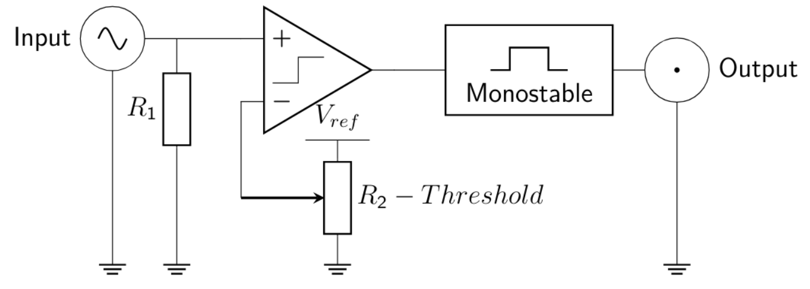

## Discriminators in Fast Signal Detection

Discriminators are fundamental building blocks in fast analog front-end systems, especially in particle physics experiments such as ALICE at CERN. Their primary function is to detect whether an input signal exceeds a predefined threshold and convert it into a digital output suitable for further processing.

Unlike simple comparators, discriminators are designed to operate in noisy environments and extract meaningful events from short, low-amplitude pulses. Key performance parameters include:

- sensitivity (minimum detectable signal)
- timing accuracy
- propagation delay
- jitter (timing uncertainty)
- double pulse resolution
- noise immunity

---

## Leading Edge Discriminator (LED)

The Leading Edge Discriminator is the simplest implementation of a threshold detection circuit. It consists of a single comparator and a reference voltage defining the detection threshold.

### Operation

- The input signal is compared with a fixed threshold \( V_{ref} \)
- When the signal crosses the threshold, the output switches state
- A monostable circuit is often used to standardize the output pulse width

### Characteristics

- simple implementation
- low power consumption
- fast response

However, the main limitation of LED is its strong dependence on signal amplitude.

---

## Time Walk and Jitter Problem

The moment at which the signal crosses the threshold depends on its amplitude. Signals with higher amplitude cross the threshold earlier than weaker ones, even if they start at the same time.

This effect, known as **time walk**, introduces timing uncertainty (jitter).

Example:

- Signal 1: 0.525 ns
- Signal 2: 0.600 ns
- Signal 3: 0.750 ns 
- jitter ≈ 0.225 ns

This makes LED unsuitable for high-precision timing applications.

---

## Constant Fraction Discriminator (CFD)

The Constant Fraction Discriminator improves timing accuracy by reducing the dependence on signal amplitude.

### Architecture

The input signal is processed in two paths:

- delayed signal
- attenuated signal

These two signals are then subtracted (differential summation), creating a bipolar waveform. The zero-crossing point of this waveform is used as the timing reference.

### Operation

- input signal is delayed by time \( T \)
- signal is attenuated by factor \( f \)
- subtraction produces a waveform with a zero-crossing
- comparator detects zero-crossing instead of fixed threshold

---

## CFD Signal Processing

The resulting waveform (difference signal) crosses zero at a point that is largely independent of the input amplitude.

### Advantages

- significantly reduced time walk
- improved timing precision

### Limitations

- more complex circuit
- requires precise delay and attenuation matching
- sensitive to noise and signal shape variations

---

## Double-Threshold Discriminator (DTD)

The Double-Threshold Discriminator combines the advantages of simple threshold detection and improved timing accuracy.

### Architecture

The system uses:

- two comparators:
  - low threshold (R2)
  - high threshold (R3)
- delay block applied to one signal path
- AND logic gate
- monostable output stage

### Operation

1. Signal crosses the low threshold → generates early trigger
2. Signal crosses the high threshold → confirms valid pulse
3. Delayed low-threshold signal and high-threshold signal are combined using AND logic
4. Output is generated only when both conditions are satisfied

---

## Timing Improvement in DTD

The use of two thresholds reduces timing uncertainty compared to LED.

Measured example:

- Δt₁ = 0.100 ns 
- Δt₂ = 0.133 ns 
- Δt₃ = 0.200 ns 

Overall jitter ≈ 0.125 ns

This is a significant improvement over the single-threshold approach.

---

## Comparison of Discriminator Architectures

| Feature              | LED        | CFD              | DTD              |
|---------------------|------------|------------------|------------------|
| Complexity          | Low        | High             | Medium           |
| Timing accuracy     | Low        | Very high        | High             |
| Time walk           | High       | Very low         | Reduced          |
| Noise sensitivity   | Medium     | High             | Medium           |
| Implementation      | Simple     | Complex          | Balanced         |

---

## Conclusion

The Leading Edge Discriminator is simple but suffers from large timing errors due to amplitude dependence.

The Constant Fraction Discriminator provides the best timing precision but requires complex analog processing.

The Double-Threshold Discriminator offers a practical compromise between complexity and performance, making it suitable for implementation in CMOS technology for fast detector systems such as the FIT detector in the ALICE experiment.
